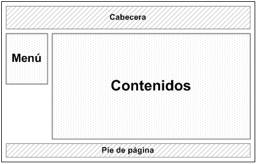
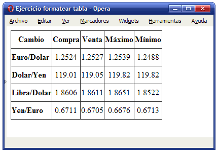
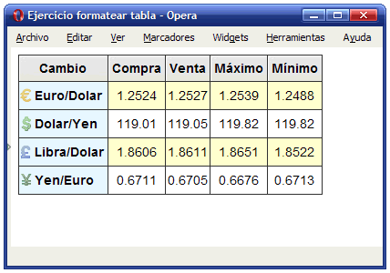
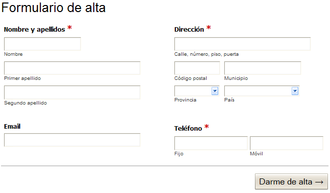
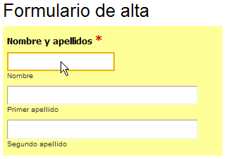
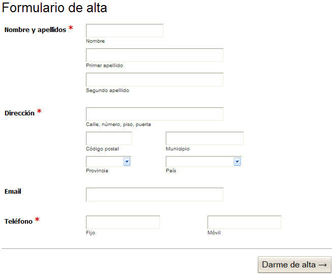
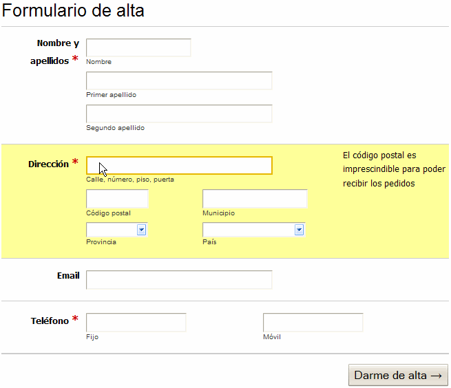

### [Ejercicio 13: css. Tablas, formularios y Layout-

#### Resumen

##### Tablas

* *border-collapse*: Define el mecanismo de fusión de los bordes de las celdas adyacentes de una tabla. El modelo *collapse* fusiona de forma automática los bordes de las celdas adyacentes, mientras que el modelo *separate* fuerza a que cada celda muestre sus cuatro bordes
* *border-spacing*: Establece la separación entre los bordes de las celdas adyacentes de una tabla. Si solamente se indica como valor una medida, se asigna ese valor como separación horizontal y vertical. Si se indican dos medidas, la primera es la separación horizontal y la segunda es la separación vertical entre celdas.
* *empty-cells*: Define el mecanismo utilizado para el tratamiento de las celdas vacías de una tabla. El valor *hide* indica que las celdas vacías no se deben mostrar. El valor *show* la muestra.
* *caption-side*: Establece la posición del título de la tabla.
* La pseudo-clase :hover permite añadir un estilo cuando el usuario pasa el ratón por encima de cada fila.

##### Formularios

* Los formularios no tienen propiedades especificas para indicar el estilo.
* Se pueden añadir estilos para mostrar un botón como un enlace.
* Se pueden mejoras en los campos de texto añadiendo un padding al elemento.
* Se pueden agragar estilos para tener las Labels alineadas y formateadas.
* Se pueden añadir estilos para tener formularios en varias columnas.
* Para resaltar el campos seleccionado se utiliza la pseudo-clase :focus.
* Para realizar todas estas modificaciones lee el [Capítulo 11. Formularios](http://librosweb.es/css/capitulo_11.html).

##### Layout
 
* En el [Capítulo 12:Layouts](http://librosweb.es/css/capitulo_12.html) aprenderás a centrar una página horizontalmente y verticalmente.
* Además aprenderás a hacer el estilo para conseguir dos tipos de layouts:

####Ejercicios

1. Determinar las reglas CSS necesarias para mostrar la siguiente tabla con el aspecto final mostrado en la imagen (modificar el código HTML que se considere necesario añadiendo los atributos class oportunos).

	Tabla original:

	

	Tabla final:

	

	*Alinear el texto de las celdas, cabeceras y título. Definir los bordes de la tabla, celdas y cabeceras (color gris oscuro #333):

		
	
	* Formatear las cabeceras de fila y columna con la imagen de fondo correspondiente en cada caso (fondo_gris.gif, euro.png, dolar.png, yen.png, libra.png). Modificar el tipo de letra de la tabla y utilizar Arial. El color azul claro es #E6F3FF.

	

	* Mostrar un color alterno en las filas de datos (color amarillo claro #FFFFCC).

		

	* [Descargar página HTML](ej/ejercicio11.html)
	* [Descargar imagen fondo_gris.gif](img/fondo_gris.gif)
	* [Descargar imagen euro.png](img/euro.png)
	* [Descargar imagen dolar.png](img/dolar.png)
	* [Descargar imagen yen.png](img/yen.png)
	* [Descargar imagen libra.png](img/libra.png)

2. A partir del código HTML proporcionado:

	* Aplicar las reglas CSS necesarias para que el formulario muestre el siguiente aspecto:

			

	*  Cuando el usuario pasa el ratón por encima de cada grupo de elementos de formulario (es decir, por encima de cada <li>) se debe modificar su color de fondo (sugerencia: color amarillo claro #FF9). Además, cuando el usuario se posiciona en un cuadro de texto, se debe modificar su borde para resaltar el campo que está activo cada momento (sugerencia: color amarillo #E6B700):

				

	* Utilizando el menor número de reglas CSS, cambiar el aspecto del formulario para que se muestre como la siguiente imagen:

		

	* Cuando el usuario pasa el ratón por encima de un grupo de elementos de formulario (es decir, por encima de cada <li>) se debe mostrar el mensaje de ayuda asociado. Añadir las reglas CSS necesarias para que el formulario tenga el aspecto definitivo mostrado en la siguiente imagen:

		

	* [Descargar página HTML](ej/ejercicio12.html)