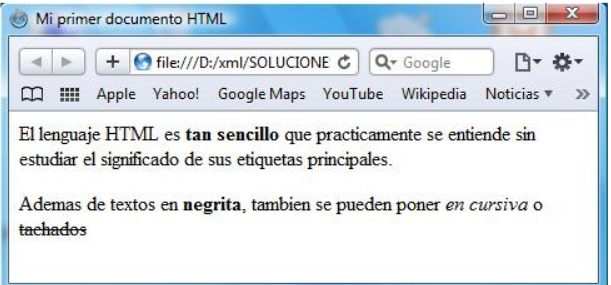

### Ejercicio 3: xhtml. Formato de texto.

1. Determinar el código HTML correspondiente a la siguiente página (utiliza com plantilla el [modelo de fichero xhtml](http://dit.gonzalonazareno.org/~josedom/xhtml/modelo.txt):

[Volver](index)
