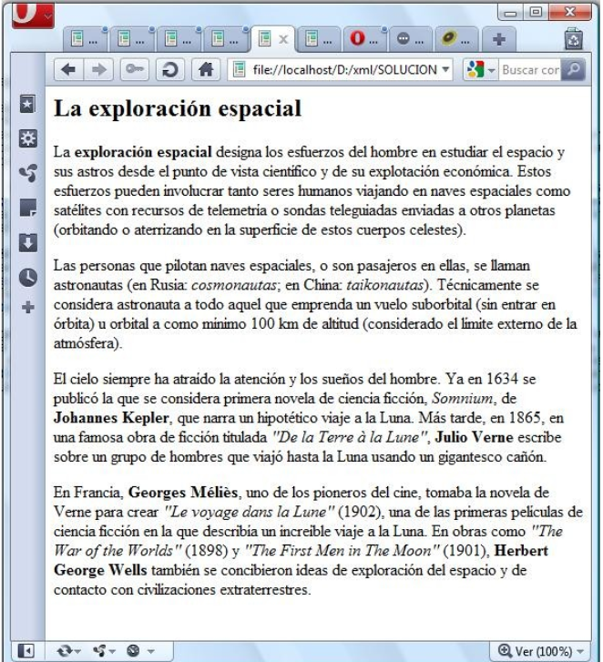
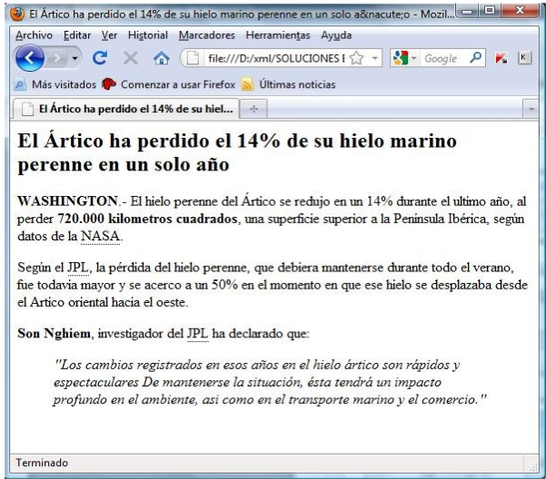
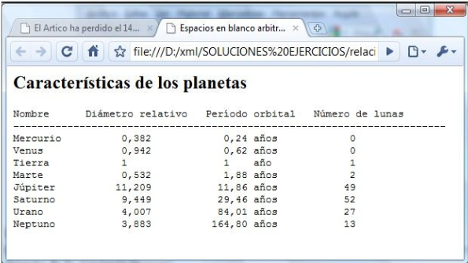
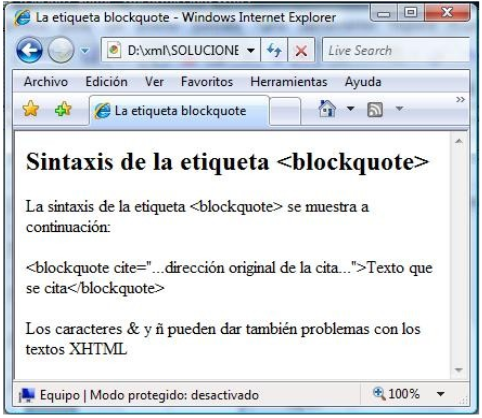
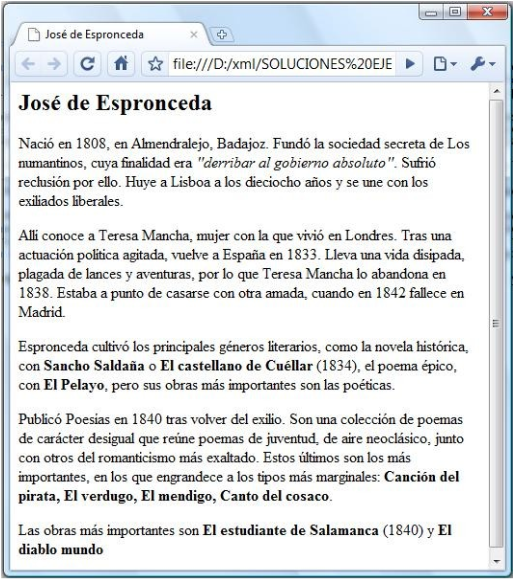
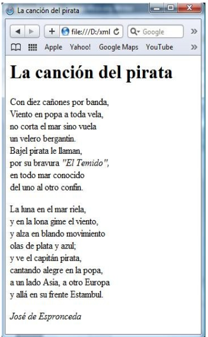

### Ejercicio 3: xhtml. Formato de texto.

1. Determinar el código HTML correspondiente a la siguiente página (utiliza com plantilla el [modelo de fichero xhtml](http://dit.gonzalonazareno.org/~josedom/xhtml/modelo.txt)):
	
	

2. Estructurar y marcar el siguiente texto extraído de la [Wikipedia](http://es.wikipedia.org/wiki/Exploracion_espacial) para que el navegador lo muestre con el aspecto de la siguiente imagen:

	

3. Estructurar y marcar el siguiente texto para que el navegador lo muestre con el aspecto de la siguiente imagen:

	

4. Determinar el código XHTML que corresponde con el siguiente documento:

	
	
5. Determinar el código XHTML que corresponde al siguiente documento:

	
	
6. Estructurar y marcar el siguiente texto para que el navegador lo muestre con el aspecto de la siguiente imagen:

	

7. Estructurar y marcar el siguiente texto para que el navegador lo muestre con el aspecto de la siguiente imagen:

	
	
8. Vuelve al ejercicio nº 2 de esta relación e incluye en su cabecera (<head>...</head>) la siguiente descripción de estilo, sustituyendo cada comentario por su correspondiente selector:

		
	
[Volver](index)
