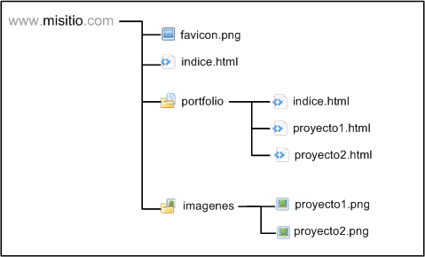
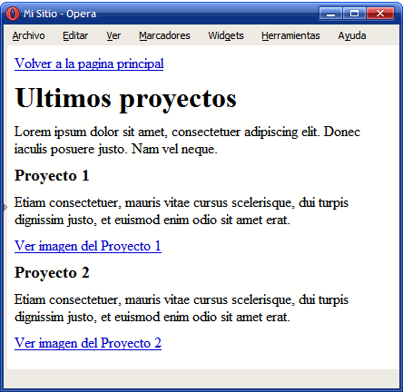
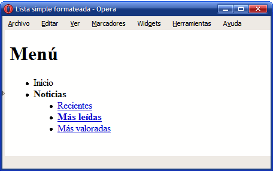
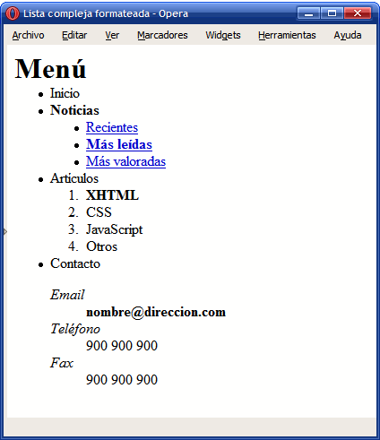

### Ejercicio 4: xhtml. Enlaces y listas.

1. A partir de la estructura de directorios y archivos indicada en la siguiente imagen:

	

	Crear la siguiente página llamada indice.html que sirva como página principal del sitio:

	 

	Crear la página de índice del portfolio:

	 	

	Enlaza el favicon en todas las páginas

	[Descargar ZIP con las imágenes](img/imagenes.zip)

2. Determinar el código HTML que corresponde a la siguiente lista anidada simple:

	 	

3. Determinar el código HTML que corresponde a la siguiente lista anidada compleja:

	 	

4. Determina el código xhtml de la siguiente página:

	

[Volver](index) 	