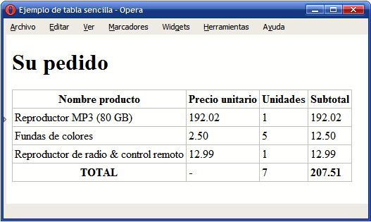

### Ejercicio 5: xhtml. Imágenes y tablas.

1. Modificar la página de índice del portfolio del ejercicio 1 del [boletín anterior](http://josedom24.github.io/mod/aplweb/ej4) para mostrar directamente las imágenes de los proyectos.

	

2. Crea una web con una imagen de un mapa de andalucía descargada de Internet. Esa imagen será un mapa de imagen de manera que si pinchamos en la zona de la provincia de sevilla se abrirá un archivo html llamado sevilla.html. Si pinchamos en la zona de Cádiz, se abrirá cadiz.html,.... (todas estas páginas estan en una carpeta llamada provincias). Las páginas sevilla.html, cadiz.html,.... sólo contendrán un enlace “volver al mapa” que permite volver a la página que contiene el mapa.

3. Determinar el código HTML necesario para crear la tabla que se muestra en la siguiente imagen. Utilizar las celdas de cabecera donde sea necesario y añadir todos los atributos posibles.

	

4. Determinar el código HTML necesario para crear la tabla que se muestra en la siguiente imagen. Utilizar las celdas de cabecera donde sea necesario y añadir todos los atributos posibles. [Descargar archivo ZIP con todas las imágenes](http://librosweb.es/ejercicios/xhtml/ejercicio12/imagenes.zip):

	

5. Determinar el código HTML necesario para crear la tabla que se muestra en la siguiente imagen. Emplear las etiquetas <table>, <tr>, <td>, <th>, <caption> y los atributos colspan, rowspan, abbr, scope, summary. [Descargar archivo ZIP con todas las imágenes](http://librosweb.es/ejercicios/xhtml/ejercicio13/imagenes.zip)

	

[Volver](index)

