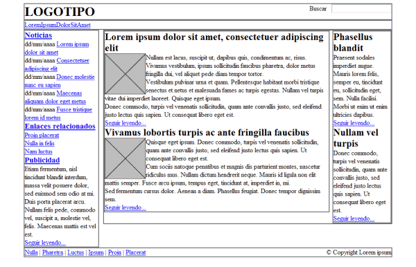
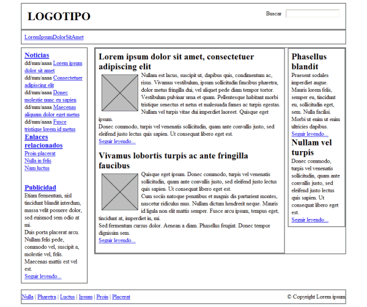
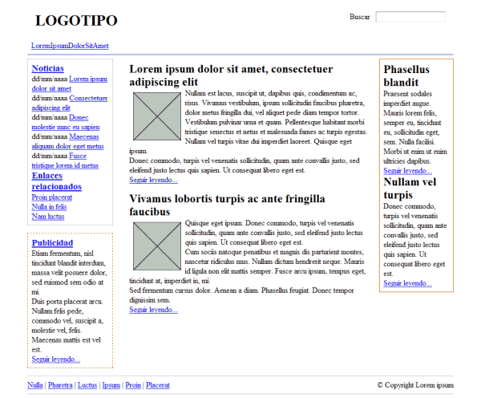

### Ejercicio 9: css. Modelos de cajas.

#### Resumen

Las partes que componen cada caja y su orden de visualización desde el punto de vista del usuario son las siguientes:

* Contenido (content): se trata del contenido HTML del elemento (las palabras de un párrafo, una imagen, el texto de una lista de elementos, etc.)
* Relleno (padding): espacio libre opcional existente entre el contenido y el borde.
* Borde (border): línea que encierra completamente el contenido y su relleno.
* Imagen de fondo (background image): imagen que se muestra por detrás del contenido y el espacio de relleno.
* Color de fondo (background color): color que se muestra por detrás del contenido y el espacio de relleno.
* Margen (margin): separación opcional existente entre la caja y el resto de cajas adyacentes.

1. Anchuras y altura: width, height
2. Margen: margin-top, margin-right, margin-bottom, margin-left, margin
3. Relleno: padding-top, padding-right, padding-bottom, padding-left, padding
4. Bordes: 
	1. Anchura: border-top-width, border-right-width, border-bottom-width, border-left-width, border-width
	2. Color: border-top-color, border-right-color, border-bottom-color, border-left-color, border-color
	3. Estilo: border-top-style, border-right-style, border-bottom-style, border-left-style, border-style
	4. Fondos: background-color, background-image, background-repeat, background-position

#### Ejercicios

1. A partir del código HTML y CSS proporcionados, determinar las reglas CSS necesarias para añadir los siguientes márgenes y rellenos:

	

	1. El elemento #cabecera debe tener un relleno de 1em en todos los lados.
	2. El elemento #menu debe tener un relleno de 0.5em en todos los lados y un margen inferior de 0.5em.
	3. El resto de elementos (#noticias, #publicidad, #principal, #secundario) deben tener 0.5em de relleno en todos sus lados, salvo el elemento #pie, que sólo debe tener relleno en la zona superior e inferior.
	4. Los elementos .articulo deben mostrar una separación entre ellos de 1em.
	5. Las imágenes de los artículos muestran un margen de 0.5em en todos sus lados.
	6. El elemento #publicidad está separado 1em de su elemento superior.
	7. El elemento #pie debe tener un margen superior de 1em.

	

	* [Descargar página HTML](ej/pagina_completa.html)
	* [Descargar archivo CSS](ej/ejercicio3.css)

2. A partir del código HTML y CSS proporcionados, determinar las reglas CSS necesarias para añadir los siguientes bordes:

	
	
    1. Eliminar el borde gris que muestran por defecto todos los elementos.
    2. El elemento #menu debe tener un borde inferior de 1 píxel y azul (#004C99).
    3. El elemento #noticias muestra un borde de 1 píxel y gris claro (#C5C5C5).
    4. El elemento #publicidad debe mostrar un borde discontinuo de 1 píxel y de color #CC6600.
    5. El lateral formado por el elemento #secundario muestra un borde de 1 píxel y de color #CC6600.
    6. El elemento #pie debe mostrar un borde superior y otro inferior de 1 píxel y color gris claro #C5C5C5.

	

	* [Descargar página HTML](ej/pagina_completa.html)
	* [Descargar archivo CSS](ej/ejercicio4.css)

3. A partir del código HTML y CSS proporcionados, determinar las reglas CSS necesarias para añadir los siguientes colores e imágenes de fondo:

	

	1. Los elementos #noticias y #pie tiene un color de fondo gris claro (#F8F8F8).
    2. El elemento #publicidad muestra un color de fondo amarillo claro (#FFF6CD).
    3. Los elementos <h2> del lateral #secundario muestran un color de fondo #DB905C y un pequeño padding de .2em.
    4. El fondo del elemento #menu se construye mediante una pequeña imagen llamada fondo_menu.gif.
    5. El logotipo del sitio se muestra mediante una imagen de fondo del elemento <h1> contenido en el elemento #cabecera (la imagen se llama logo.gif).

	    

	* [Descargar página HTML](ej/pagina_completa.html)
	* [Descargar archivo CSS](ej/ejercicio5.css)
	* [Descargar imagen fondo_menu.gif](ej/fondo_menu.gif)
	* [Descargar imagen logo.gif](ej/logo.gif)