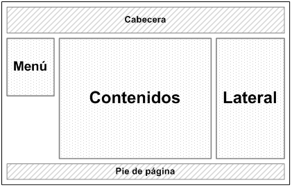

### Proyecto xhtml y css

El proyecto consiste en realizar una web en la que darás información a futuros alumnos de cómo
funciona nuestro ciclo SMR.

1. El primer paso será elegir el contenido que quiere mostrar en ella. Puedes incluir información de cada asignatura por curso, profesores que la imparten este curso, aulas utilizadas. También puedes incluir un apartado sobre el centro y sus instalaciones.
2. El segundo elegir el diseño. Para ello podrás utilizar plantillas CSS ya diseñadas. Páginas de ejemplo:
	* [http://www.mejoresplantillasgratis.es/free-templates/Plantillas-CSS.html](http://www.mejoresplantillasgratis.es/free-templates/Plantillas-CSS.html)
	* [http://www.freecsstemplates.org/](http://www.freecsstemplates.org/)
	
	Descarga la que te guste y estudia el código, tanto el HTML como el CSS. Se valorará de forma positiva el uso de hojas de etilos **adaptables** para que se visualice de manera optima en dispositivos móviles.
3. Modifica el HTML y el CSS de la plantilla para que se adapte a lo que necesitas. Puedes incluir los elementos que desees, para ello puedes utilizar código ya creado que puedas encontrar en Internet. Por ejemplo, en la siguiente página encontrarás distintos menús:
[http://www.araudi.net/ejemplos/menus_desplegables_CSS.html](http://www.araudi.net/ejemplos/menus_desplegables_CSS.html). Si quieres puedes incluir javascript, en esta página puedes encontrar algunos ejemplos: [http://www.htmlpoint.com/jscript/index.html](http://www.htmlpoint.com/jscript/index.html).

#### Características que debe tener el sitio web realizado

1. La página debe tener al menos 5 páginas webs enlazadas entre si.
2. La página debe estar hecha en HTML5 y todas las páginas deberán ser válidas.
3. El layout de las páginas realizadas debe tener al menos los siguientes componentes:
	* Cabecera (header) que incluye todos los elementos invariantes de la parte superior de la página (logotipo, imagen o banner, cuadro de búsqueda superior, etc.)
	* Contenido (content) engloba el contenido principal del sitio (la zona de noticias, la zona de artículos, la zona de productos, etc. dependiendo del tipo de sitio web)
	* Menú (menu) se emplea para agrupar todos los elementos del menú lateral de navegación de la página
	* Pie (footer) que incluye todos los elementos invariantes de la parte inferior de la página (aviso de copyright, política de privacidad, términos de uso, etc.)
	* Lateral (sidebar) se emplea para agrupar los elementos de las columnas laterales y secundarias de la página.

	

4. Se deben utilizar las etiquetas de texto estudiadas: títulos, párrafos, marcado de texto,...
5. Al menos en una página debe existir enlaces a la misma página.
6. Debe existir enlaces a páginas externas a nuestro sitio web.
7. Debe existir alguna lista ordenada y no ordenada.
8. Se deben incluir imágenes.
9. Se debe incluir un mapa de imagen.
10. Debe existir al menos una tabla.
11. Debe existir un formulario que envíe los datos *http://dit.gonzalonazareno.org/~josedom/aweb/resultado.php*.
12. Todas las páginas deben tener un favicon.

#### Documentación a entregar

* Estructura de ficheros que forman el sitio web comprimido.
* La URL de la página donde tienes alojada la página, teniendo en cuenta que debe estar guardada en un directorio llamado **proyecto**.
* Breve documento donde se describirá la página y se indicarán el origen de las plantillas descargadas y los códigos extra que hayamos incluido en nuestra web (menús,javascript,...)
* Capturas de pantalla donde se vea la validación ed cada una de las páginas.

[Volver](index)