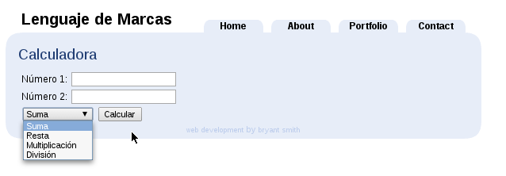
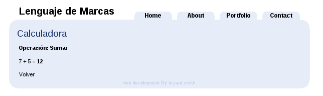

### Bottle

1. Realiza una aplicación web con Bottle, que muestre la siguiente página principal:

	

	Para ello utiliza la siguiente [plantilla xhtml](fich/BlueBliss.zip).
	
	Cuando pulsamos el botón de "calcular" se debe mostrar una página con el siguiente aspecto:
	
	
	
2. Realiza una página web que muestre la tabla de multiplicar de un número indicado en la URL.	Por ejemplo http://localhost:8080/tabla/6 muestra una página con la tabla de multiplicar del 6.

3. Realiza una página web donde se muestre una lista de museos de Sevilla usando listas html, de la siguiente manera:

	* Museo Arqueológico
		* Plaza de Amorica, s/n
		* 954786465
	* Museo de Artes y Costumbres Populares</SimpleData>
		* Plaza de Amtrica, 3 - Pabellón Mudejar, Parque de Maria Luisa
		* 954712391

		Los datos los debes leer del fichero [Museos.xml](fich/Museos.xml)