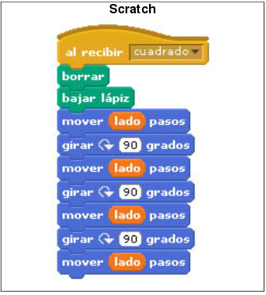

### Ejercicio 1 Scratch

#### Estructura secuencial

1. Dibujar un cuadrado:

	

2. Dibuja un triangulo y un rectangulo.
3. Haz que el gato diga "Hola Mundo", espere 3 segundo y luego diga "Hasta luego".
4. Movimientos: 
	* Mueve al gato a la derecha e izquierda, según pulsemos las teclas del cursor. El gato se debe mover 10 pasos, debe apuntar en la dirección deseada, y por último debe cambiar el disfraz para simular que está andando. (Nota: El estilo de rotación del objeto debe ser izquierda - derecha)
	* Cuando pulsemos el espacio el gato debe maullar.
	* Introduce la posibilidad de mover arriba y abajo el gato. en este caso el gato no debe girar.

#### Variables

1. Pedir un nombre por teclado, y hacer que el gato diga "Hola Nombre".
2. Calcular el perímetro y área de un rectángulo dada su base y su altura.
3. Dados dos números, mostrar la suma, resta, división y multiplicación de ambos.

[Volver](index)

