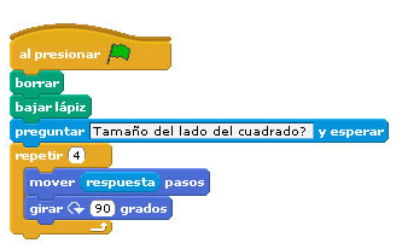

### Ejercicio 2 Scratch

#### Estructura repetitiva

1. Dibujar un cuadrado, el tamaño del lado se pide por teclado:

	

2. Haz que el gato diga 5 veces "Hola, que pasa!!!"
3. Uso de un contador. Haz que el gato cuente del 1 al 10.
4. Haz que el gato ande indefinidamente de izquierda a derecha. Cambia el disfraz para simular que está andando. Haz que rebote en las paredes y gire al sentido contrario.
5. El gato te debe pedir un número, y decirte la tabla de multiplicar de ese número.
6. Uso de un acumulador. El gato calcula una potencia. Te pide la base y el exponente y te da el resultado de la potencia.

[Volver](index)