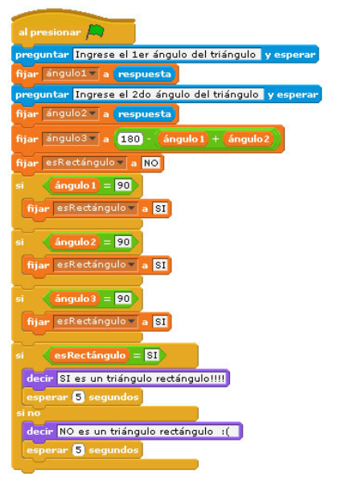
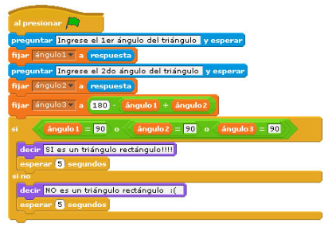

### Ejercicio 3 Scratch

#### Estructura condicional

1. Realiza un programa donde el gato te pida la nota que has sacado, si es mayor o igual que cindo, te dice "Aprobado", sino te dirá "Suspenso".
2. Ahora el gato te pide dos números, y te dice cuál es el mayor.
3. Mejora el ejercicio 4 del [boletín anterioro](scratch2) para que cuando pulsemos la tecla espacio, al gato nos diga cuantas veces ha chocado con la pared.
4. ¿Hay alguna diferencia entre estos dos programas?

	
	

5. Juego: Adivina el número. Vamos a hacer que el gato piense un número aleatorio, entre el 1 y el 100.  Nos va piediendo que digamos un número hasta que lo acertemos. Si el número que introducimos es menor al que él ha pensado, nos dice "El número que yo he pensado es mayor", en el caso en que el número es mayor nos dirá "El número que yo he pensado es menor". Cuando digamos el número pensado, dirá "Muy bien, has acertado!!!".
6. Modifica el ejercicio anterior, para que nos diga en cuantos intentos hemos acertado el número.

[Volver](index)