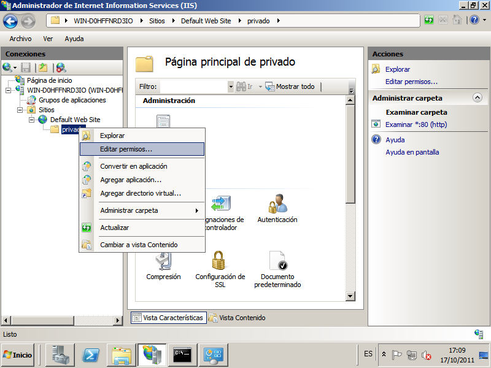

### Ejercicio: Acceso autentificado al servidor IIS

Otra interesante opción que podemos habilitar en las páginas web de nuestro centro, es la creación de contenidos que sólo puedan ser accedidos vía web mediante el navegador, previa validación del usuario que desea acceder a dichos contenidos, de modo que si el usuario que se autentica está habilitado para ello, accederá a visualizar los contenidos indicados, y en caso contrario no.

* Lo primero que tenemos que instalar es un nuevo **Servicio al rol de IIS 7: Autentificación básica**. Luego tendremos que ir al apartado *"Autentificación"* y habilitar la autentificación básica y deshabilitar la anónima.

En la página de la práctica anterior *www.iesgn.com*, vamos a crear una zona privada que sólo podrán acceder los profesores. Para ello vamos a realizar los siguientes pasos:

1. En el directorio base de www.iesgn.com (c:/inetpub/ies) vamos a crear una carpeta llamada **"profesores"**, que será la carpeta que vamos a controlar su acceso por medio de la autentificación.

 Dentro de esta carpeta crea un archivo index.html con un mensaje de bienvenida a la zona privada de los profesores.

2. Vamos a crear una serie de usuario y un grupo llamado "Profesores", par ello:

 *Inicio->Herramientas administrativas->Administración del equipos-> Usuarios y grupos locales*

 Vamos a crear cuatro usuarios: José, María, Jesús y Raúl, y un grupo llamado Profesores, y vamos añadir a este grupo sólo los usuarios José y María. Las contraseñas de los usuarios deben ser las mismas para que sea fácil probar el funcionamiento.

3. A continuación le damos los permisos necesarios a la carpeta C:/inetpub/ies/profesores, para ello botón derecho->Editar permisos->seguridad

 En primer lugar hemos de romper la herencia de permisos sobre esta carpeta: pulsando sobre el botón *"Opciones avanzadas"* en la ventana de la imagen anterior para posteriormente desactivar la casilla "Incluir todos los permisos heredables del objeto primario de este objeto" en la nueva ventana mostrada, y pulsando tras ello sobre el botón "Copiar" en la ventana mostrada tras desactivar dicha casilla.

 Una vez que hayamos roto la herencia de permisos sobre esta carpeta, los permisos mostrados serán los mismos, pero con la diferencia de que ahora podremos modificarlos a nuestro gusto, luego nos ubicaremos sobre el grupo "Usuarios" y tras ello pulsaremos sobre el botón "Quitar";

 A continuación debemos hacer los siguiente:

* Quitar el grupo Usuarios, para no permitir el acceso a ningún usuario.
* Agregar el grupo Profesores, con los permisos con los permisos de "Lectura y ejecución", "Mostrar el contenido de la carpeta" y "Leer", de modo que cuando la ventana de la imagen superior presente el aspecto mostrado en la imagen inferior, pulsaremos sobre el botón "Aceptar".

4. Desde el cliente prueba a acceder a la página *www.iesgn.com/profesores* y prueba a acceder con un usuario perteneciente al grupo "profesores" y otro que no pertenezca.

Desde la consola de configuración del servidor IIS pulsamos sobre la opción "Editar permisos..." de la carpeta "privado", será una pantalla parecida a esta:

El objetivo de esta práctica es la puesta en marcha de dos sitios web utilizando el mismo servidor web IIS. Hay que tener en cuenta lo siguiente:

* Cada sitio web tendra nombres distintos.
* Cada sitio web compartiran la misma dirección IP y el mismo puerto (80).

Para ello vamos a configurar el servidor web IIS para crear dos nuevos sitios web (**el sitio web predeterminado lo debemos detener**).

Para terminar lo único que tendremos que hacer es cambiar el fichero hosts en los clientes y poner dos nuevas líneas donde se haga la conversión entre los dos nombre de dominio y la dirección IP del servidor.

##### **Ejercicios**

Queremos construir en nuestro servidor web IIS dos sitios web con las siguientes características:

1. El nombre de dominio del primero será *www.iesgn.com*, su directorio base será *c:/inetpub/ies* y contendrá una página llamada index.html, donde sólo se verá una bienvenida a la página del insituto Gonzalo Nazareno.
2. En el segundo sitio vamos a crear una página donde se pondrán noticias por parte de los departamento, el nombre de este sitio será *www.departamentosgn.com*, y su directorio base será *c:/inetpub/departamentos*. En este sitio sólo tendremos una página inicial index.html, dando la bienvenida a la página de los departamentos del instituto.

Modifica el fichero hosts en los clientes y en el servidor para que se pueda acceder a los sitios web creados.

[Volver](index)
