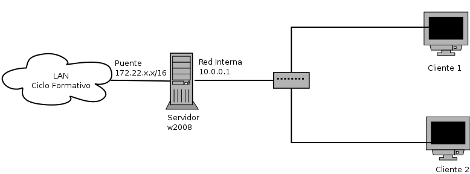

### Proyecto 1: Configuración de un servidor Windows Server

Te han contratado como administrador de redes en una empresa que posee una red de ordenadores con varios clientes y un servidor donde se ha instalado un sistema operativo Windows 2008. Actualmente la dirección de la empresa quiere mejorar la gestión de la red y ese es tu objetivo. Quieren mejorar los siguientes aspectos de la red:

* Actualmente la configuración de red de los cliente se hacía de forma estática, en un segmento de direcciones 10.0.0.0/24. Quieren tener un sistema de asignación dinámica de direcciones IP.
* Quieren crear varias páginas web para dar servicio a la intranet para ello han contratado un dominio masterlan.com
* Para poder acceder a los distintas máquinas de la intranet, se necesita que instales un servidor DNS.
* Los documentos importantes de la empresa deben ser accesible desde un servidor ftp anónimo.
* Un grupo de usuarios (los técnicos) pueden gestionar el servidor de forma remota.
* Todos los usuarios deben poseer una cuenta de correos de la forma usuario@masterlan.com

#### Esquema de red

El esquema de red que tiene la empresa es el siguiente:

Como se observa en el esquema nuestro ordenador va a tener dos tarjetas de red, por lo tanto va a ser el
responsable de gestionar la comunicación que entra y sale de nuestra red local.

La primera tarjeta está conectada a internet (en nuestro caso está conectada a la red del instituto), la segunda tarjeta está conectada a la red local y tiene el siguiente direccionamiento:

* Dirección IP: 10.0.0.1/24

#### Servidor DHCP

Los ordenadores clientes de nuestra LAN obtienen su configuración de red ofrecidas por dicho servidor, que tiene las siguientes características:

* Rango: 10.0.0.2-10.0.0.200
* Máscara de red: 255.255.255.0 
* Puerta de enlace: La ip del router
* DNS: 8.8.8.8

##### **Entrega 1**
1. Escribe una introducción donde expliques el objetivo de la práctica. El esquema real que estás desarrollando y cómo lo vas a virtualizar para poder desarrollarlo en clase. Por último indica el nombre que le has puesto al ordenador servidor. ¿Cómo has configurado ese nombre?
2. Explica la configuración de red del servidor y de los dos clientes
3. Explica la configuración del servidor para que funcione como router y nat
4. Explica la instalación y configuración del servidor DHCP.
5. Prueba de funcionamiento (Concesiones de direcciones)
6. Realiza una reserva de uno de los clientes, explica cómo lo has realizado y haz una prueba de funcionamiento.

#### Servidor WEB

Se necesitan crear dos páginas webs con las siguientes características:

* La primera se llamará **www.masterlan.com**, su directorio base será *c:/web/principal*. Es la página corporativa de la empresa, y tendrá una zona privada autentificada para los clientes de la empresa.
* La segunda se llamará **direccion.masterlan.com**, su directorio base será *c:/web/privado*. Es la página de trabajo de los trabajadores de la empresa. El acceso a esta página será auntentificada y sólo podrán entrar los trabajadores.

##### **Entrega 2**
1. Crea los usuarios que creas necesarios para hacer la pruebas de autentificación. Del mismo modo crea los grupos que vas a necesitar. Explica el proceso de creación de usuario y grupos.
2. Crea los dos sitios virtuales, explica el proceso de creación de hosts virtuales.
3. Elije una plantilla adecuada, y modifícala de tal manera que aparezca el nombre de la empresa (invéntatelo). En cada página tiene que haber un enlace a la otra página. Y en la primera debe haber un enlace a la zona de clientes.
4. Autentificación de las páginas. Utilizando autentificación básica explica el proceso para que la zona de clientes de la primera página sólo sea accesible por los clientes de la empresa, y que la segunda página sólo sea accesible por los trabajadores.
5. Muestra la modificación de los ficheros hosts para el acceso desde los clientes.
6. Por medio de capturas de pantalla, demuestra como se accede a las distintas páginas.

#### Servidor DNS

Actualmente la resolución de nombres se está haciendo de forma estática. Es necesario la instalación y configuración de un servidor DNS en nuestro servidor Windows Server 2008 que le permita a todos los clientes poder resolver los nombres de nuestro dominio masterlan.com.

**Nota: Es necesario que borres todos las resoluciones que habías indicado en los ficheros hosts de los clientes.**

Instala un servidor DNS con las siguientes características:

* El servidor DNS, que está en el servidor Windows 2008, se llama *nombredelservidor*.masterlan.com
* Vamos a suponer que existe un servidor de correos, en la dirección 10.0.0.100, se llama mail.masterlan.com
* Se debe conocer las direcciones de las dos páginas webs: www.masterlan.com y direccion.masterlan.com.
* Se debe conocer el nombre de la dirección ip del servidor.

Configura el servidor DNS de manera adecuada, y modifica el servidor DHCP para mandar a los clientes como DNS la dirección del servidor.

##### **Entrega 3**
1. Escribe una pequeña guía de como se instala el servidor DNS. Indica las ventajas de tener instalado un servidor DNS en una intranet.
2. Indica el cambio que hay que hacer en el servidor dhcp para que el sistema funcione de manera adecuada.
3. Vuelve a asignar de forma dinámica la configuración de red a los clientes, y haz una prueba de funcionamiento accediendo a alguna de las páginas web de masterlan.com y accediendo a alguna otra página web.
4. Para comprobar el funcionamiento, copia las salidas de los comandos nslookup/dig 

* Servidor DNS de masterlan.com 
* Dirección ip de www.masterlan.com
* Servidor de correo que obtiene los correos enviados a masterlan.com 
* Nombre de la dirección 10.0.0.1
* Dirección IP de www.josedomingo.org

#### Servidor FTP

Se quiere instalar y configurar un servidor FTP que nos permita el acceso al sistema de archivos del servidor, se quiere configurar el servidor con las siguientes funcionalidades:

* FTP autentificado: Queremos que el usuario director, acceda de forma autentificada al servidor y que acceda a los ficheros del sitio web direccion.masterlan.com, y de esta forma poder gestionar dicho sitio.
* FTP anónimo: Se accederá a un directorio donde encontramos los documentos importantes de la empresa.

El nombre del servidor FTP será ftp.masterlan.com

#### Servidor Acceso Remoto

Para facilitar el trabajo de los empleados de la empresa, queremos configurar el servidor para que permita el acceso remoto al grupo de usuario de los trabajadores.

##### **Entrega 4**
1. Indica la modificación en el servidor DNS para poder acceder a ftp.masterlan.com
2. Indica la modificación que hay que realizar en el servidor web para que el director pueda gestionar la página direccion.masterlan.com
3. Realiza una pequeña guía de como se instala y configura el servidor FTP para que ofrezca las funcionalidades anteriormente indicada.
4. Haz una prueba de funcionamiento accediendo al servidor FTP de forma autentificad y de forma anónima.
5. Explica como configurar el acceso remoto al servidor para que sólo accedan los usuarios "trabajadores".
6. Realiza una prueba de funcionamiento accediendo remotamente.

#### Servidor de Correo Electrónico

Queremos ofrecer un servicio de correo electrónico entre los trabajadores de la empresa. Nuestro sistema no va a enviar o recibir correos desde el exterior. Para ello vamos a instalar el servidor de correo hMailServer y vamos a crear dos buzones para los usuarios del sistemas. El servidor que envía correo se llamará smtp.masterlan.com y el servidor pop3 se llamará correo.masterlan.com.

Configura en el cliente el thunderbird con las cuentas de correos de los usuarios.

##### **Entrega 5**
1. Indica la modificación en el servidor DNS para que le sistema funcione.
2. Escribe un pequeño manual de cómo has instalado y configurado dos buzones de correos.
3. Explica como has configurado la cuenta de correos en los clientes thunderbird.
4. Realiza una prueba de funcionamiento donde se comprueba que se ha enviado un correo y se ha recibido.

[Volver](index)