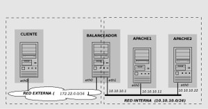

### Balanceo de carga en servidores Apache con HAproxy

#### (9 tareas - 20 puntos)(4 tareas obligatorias - 9 puntos)

En primer lugar, construye con KVM con vagrant la siguiente infraestructura:

Ajustar la configuración de las dos máquinas del cluster de balanceo (apache1 y apache2)

1. Deshabilitar la opción KeepAlive en el fichero de configuración /etc/apache2/apache2.conf para realizar la evaluación del rendimiento sin la opción de reutilización de conexiones.

		apache1:~# nano /etc/apache2/apache2.conf
		...
		KeepAlive Off
		...		

		apache2:~# nano /etc/apache2/apache2.conf
		...
		KeepAlive Off
		...

    Nota: este ajuste no es estrictamente necesario (y sería desaconsejable en un entorno de producción real), pero facilita las pruebas manuales dado que permite detectar inmediatamente el "cambio" de destino resultado del balanceo de carga manteniendo la opción por defecto, en las pruebas manuales desde el navegador sería necesario esperar 5 segundos (el time out de keep alive) antes de recargar la página y ver el efecto del reparto de carga

2. Editar los archivos del sitio web para incluir una indicación del servidor real que está sirviendo una petición, de modo que sea posible ''diferenciarlos'' en las pruebas manuales con el navegador 
		
	En apache1

		apache1:~# nano /var/www/html/index.html
		...
		<h1> Servidor por APACHE_UNO </h1>
		...
		apache1:~# nano /var/www/html/sesion.php	
		

		<?php
		header('Content-Type: text/plain');
		session_start();
		if(!isset($_SESSION['visit']))
		{
		        echo "This is the first time you're visiting this server";
		        $_SESSION['visit'] = 0;
		}
		else
		        echo "Your number of visits: ".$_SESSION['visit'];		

		$_SESSION['visit']++;		

		echo "\nServer IP: ".$_SERVER['SERVER_ADDR'];
		echo "\nClient IP: ".$_SERVER['REMOTE_ADDR'];
		echo "\nX-Forwarded-for: ".$_SERVER['HTTP_X_FORWARDED_FOR']."\n";
		print_r($_COOKIE);
		?>

    En apache2	

		apache2:~# nano /var/www/html/index.html
		...
		<h1> Servidor por APACHE_DOS </h1>
		...		

	Y el sesion.php con el mismo contenido.
		

    Nota: este ajuste es simplemente una herramienta de depuración en una "granja" de servidores real este comportamiento no tendría sentido, dado que, obviamente, todos los nodos servirían el mismo contenido/aplicaciones

3. Crear en ambas máquinas (apache1, apache2) el script PHP sleep.php:
    
	    apache1~:# nano /var/www/html/sleep.php

		<html>
			<title> Retardos de x segundos </title>
		<body>
			<h1> Prueba con retardo de x segundos </h1>
			
 hora de inicio: <?php echo date('h:i:s'); ?> 

			<?php
			for ($i=0; $i < 2000000; $i++) { 
				$str1 = sha1(rand()*rand());
				$str2 = sha1(rand()*rand());
				$str3 = sha1($str1+$str2);
			}
			?>
			
 hora de fin: <?php echo date('h:i:s'); ?> 

		</body>
		</html>

    Comprobación

    	apache1~:# php /var/www/html/sleep.php
	    apache2~:# php /var/www/html/sleep.php

#### Evaluar rendimiento de un servidor Apache sin balanceo

Se realizarán varias pruebas de carga sobre el servidor Apache ubicado en la máquina apache1. Pasos a realizar:

1. Habilitar en **balanceador** la redirección de puertos para que sea accesible el servidor Apache de la máquina apache1 [10.10.10.11] empleando el siguiente comando iptables

		balanceador:~# echo 1 > /proc/sys/net/ipv4/ip_forward
		balanceador:~# iptables -t nat -A PREROUTING \
	                            --in-interface eth0 --protocol tcp --dport 80 \
	                            -j DNAT --to-destination 10.10.10.11

	Nota: la regla iptables establece una redirección del puerto 80 de la máquina balanceador al mismo puerto de la máquina apache1 para el tráfico procedente de la red externa (interfaz de entrada eth0).

2. Arrancar en apache1 [10.10.10.11] el servidor web Apache

		apache1:~# /etc/init.d/apache2 start

	Nota: Desde la máquina cliente se puede abrir en un navegador web la URL http://172.22.x.x para comprobar que el servidor está arrancado y que la redirección del puerto 80 está funcionando.

3. Lanzar las pruebas de carga iniciales sobre balanceador usando el herramienta Apache Benchmark

	Prueba 1: Contenido estático

		cliente:~# ab -n 2000 -c 10 http://172.22.x.x/index.html
		cliente:~# ab -n 2000 -c 50 http://172.22.x.x/index.html
		cliente:~# ab -n 2000 -c 100 http://172.22.x.x/index.html

    Envía 2000 peticiones HTTP sobre la URI ''estática'', manteniendo, respectivamente, 10 y 50 conexiones concurrentes. 

	Prueba 2: Scripts PHP

    Se usará un script PHP (sleep.php) que introduce un retardo mediante un bucle "activo" de 2000000 iteraciones que busca forzar el uso de CPU con cálculos de hashes SHA1 y concatenaciones de cadenas.

		cliente:~# ab -n 250 -c 10 http://172.22.x.x/sleep.php
		cliente:~# ab -n 250 -c 30 http://172.22.x.x/sleep.php
		cliente:~# ab -n 250 -c 50 http://172.22.x.x/sleep.php

	Envía 250 peticiones HTTP sobre la URI "dinámica", manteniendo, respectivamente, 10 y 30 conexiones concurrentes. (aprox 5-7 minutos)

* **Tarea 1 (3 puntos)(Obligatorio)**: Ejecuta varias veces los comandos ab con cada una de las pruebas y calcula la media de los resultados obtenidos (Requests per second (número peticiones por segundo) ó Time per request (tiempo en milisegundos para procesar cada petición)) para cada una de las cargas.

#### Configurar y evaluar balanceo de carga con dos servidores Apache

1. Deshabilitar la redirección del puerto 80 de la máquina balanceador concatenaciones el siguiente comando iptables (HAproxy se encargará de retransmitir ese tráfico sin necesidad de redireccionar los puertos)
2. Arrancar los servidores Apache de apache1 [10.10.10.11] y apache2 [10.10.10.22]
3. Instalar HAproxy en balanceador
4. Configurar HAproxy en balanceador (de momento sin soporte de sesiones persistentes)

		balanceador:~# cd /etc/haproxy
	    balanceador:/etc/haproxy/# mv haproxy.cfg haproxy.cfg.original
	    balanceador:/etc/haproxy/# nano haproxy.cfg	

	    global
	        daemon
	        maxconn 256
	        user    haproxy
	        group   haproxy
	        log     127.0.0.1       local0
	        log     127.0.0.1       local1  notice	

		defaults
	        mode    http
	        log     global
	        timeout connect 5000ms
	        timeout client  50000ms
	        timeout server  50000ms	

		listen granja_cda 
	        bind 193.147.87.47:80
	        mode http
	        stats enable
	        stats auth  cda:cda
	        balance roundrobin
	        server uno 10.10.10.11:80 maxconn 128
	        server dos 10.10.10.22:80 maxconn 128

	Define (en la sección listen) un "proxy inverso" de nombre granja_cda que:

	* trabajará en modo http (la otra alternativa es el modo tcp, pero no analiza las peticiones/respuestas HTTP, sólo retransmite paquetes TCP)
	* atendiendo peticiones en el puerto 80 del balanceador
	* con balanceo round-robin
	* que repartirá las peticiones entre dos servidores reales (de nombres uno y dos) en el puerto 80 de las direcciones 10.10.10.11 y 10.10.10.22
	* adicionalmente, habilita la consola Web de estadísticas, accesible con las credenciales cda:cda

	Más detalles en [Opciones de configuración HAPproxy 1.5](http://cbonte.github.io/haproxy-dconv/configuration-1.5.html)

5. Iniciar HAproxy en balanceador: Antes de hacerlo es necesario habilitar en /etc/default/haproxy el arranque de HAproxy desde los scripts de inicio, estableciendo la variable ENABLED=1
6. Desde la máquina cliente abrir en un navegador web la URL http://172.22.x.x y recargar varias veces para comprobar como cambia el servidor real que responde las peticiones.

	Nota: Si no se ha deshabilitado la opción KeepAlive de Apache, es necesario esperar 5 segundos entre las recargas para que se agote el tiempo de espera para cerrar completamente la conexión HTTP y que pase a ser atendida por otro servidor. 

	
	

	* **Tarea 2 (1 puntos)(Obligatorio)**: Muestra al profesor y entrega capturas de pantalla que el balanceador está funcionando.	

	

7. Desde la máquina cliente repetir las pruebas de carga con ab:

    Los resultados deberían de ser mejores que con la prueba anterior con un servidor Apache único (al menos en el caso del script sleep.php)

	
	

	* **Tarea 3 (3 puntos)(Obligatorio)**: Ejecuta varias veces los comandos ab con cada una de las pruebas y calcula la media de los resultados obtenidos (Requests per second (número peticiones por segundo) ó Time per request (tiempo en milisegundos para procesar cada petición)) para cada una de las cargas. ¿Son mejores que con un solo servidor web?	

	

8. Desde la máquina cliente  abrir en un navegador web la URL http://172.22.x.x/haproxy?stats para inspeccionar las estadísticas del balanceador HAProxy (pedirá un usuario y un password, ambos cda)

	
	

	* **Tarea 4 (1 punto)**: Entrega una captura de pantalla donde se vea la página web de estadísticas de haproxy.	

	

9. Desde uno de los servidores (apache1 ó apache2), verificar los logs del servidor Apache

		apacheN:~# tail /var/log/apache2/error.log
		apacheN:~# tail /var/log/apache2/access.log

	
	
    
    * **Tarea 5 (1 punto)**: En todos los casos debería figurar como única dirección IP cliente la IP interna de la máquina balanceador [10.10.10.1]. ¿Por qué?

	

#### Configurar la persistencia de conexiones Web (sticky sessions)

1. Detener HAproxy en la máquina balanceador 
2. Añadir las opciones de persistencia de conexiones HTTP (sticky cookies) al fichero de configuración

		balanceador:~# nano /etc/haproxy/haproxy.cfg

    	Contenido a incluir: (añadidos marcados con <- aquí)

		global
			daemon
			maxconn 256
			user    haproxy
			group   haproxy
			log     127.0.0.1       local0
			log     127.0.0.1       local1  notice		

		defaults
			mode    http
			log     global
			timeout connect 10000ms
			timeout client  50000ms
			timeout server  50000ms		

		listen granja_cda 
		    bind 172.22.x.x:80 #aquí pon la dirección ip del balanceador
		    mode http
		    stats enable
		    stats auth  cda:cda
		    balance roundrobin
		    cookie PHPSESSID prefix                               # <- aquí
		    server uno 10.10.10.11:80 cookie EL_UNO maxconn 128   # <- aquí
		    server dos 10.10.10.22:80 cookie EL_DOS maxconn 128   # <- aquí

    El parámetro cookie especifica el nombre de la cookie que se usa como identificador único de la sesión del cliente (en el caso de aplicaciones web PHP se suele utilizar por defecto el nombre PHPSESSID). Para cada "servidor real" se especifica una etiqueta identificativa exclusiva mediante el parámetro cookie. Con esa información HAproxy reescribirá las cabeceras HTTP de peticiones y respuestas para seguir la pista de las sesiones establecidas en cada "servidor real" usando el nombre de cookie especificado (PHPSESSID)
        
    * conexión cliente -> balanceador HAproxy : cookie original + etiqueta de servidor
    * conexión balanceador HAproxy -> servidor : cookie original

3. Iniciar HAproxy en la máquina balanceador 
4. En la máquina cliente, arrancar el sniffer de red whireshark y ponerlo en escucha sobre el interfaz eth0 (fijar como filtro la cadena http para que solo muestre las peticiones y respuestas HTTP).
5. En la máquina cliente:
        
    * desde el navegador web acceder varias veces a la URL http://172.22.x.x/sesion.php (comprobar el incremento del contador [variable de sesión])
    * acceder la misma URL desde el navegador en modo texto lynx (o desde una pestaña de ''incógnito'' de Iceweasel para forzar la creación de una nueva sesión)

		cliente:~# lynx -accept-all-cookies  http://172.22.x.x/sesion.php

6. Detener la captura de tráfico en wireshark y comprobar las peticiones/respuestas HTTP capturadas

	
	

	* **Tarea 6 (3 puntos)**:Verificar la estructura y valores de las cookies PHPSESSID intercambiadas. En la primera respuesta HTTP (inicio de sesión), se establece su valor con un parámetro HTTP SetCookie en la cabecera de la respuesta. Las sucesivas peticiones del cliente incluyen el valor de esa cookie (parámetro HTTP Cookie en la cabecera de las peticiones)

	

#### Configurar lbass en openstack

1. Crea dos instancias en el cloud que sean servidor web y crea en cada una de ella un fichero index.html y sesion.php similares a los de la tarea enterior.
2. Siguiendo la documentación ofrecida, configura un balanceador de carga en openstack.

	
* **Tarea 7 (2 puntos)(Obligatorio)**: Muestra al profesor y documenta el proceso de creación del balanceador de carga para comprobar el funcionamiento cuando accedemos a las páginas html.
* **Tarea 8 (3 puntos)**: Configura de manera adecuada el balanceador de carga para que tenga en cuenta la persistencia de sesiones. Muestra al profesor su funcionamiento accediendo al fichero sesion.php y documenta los cambios que has configurado.
* **Tarea 9 (3 puntos)**: Crea otra instancia con un servidor mysql, e instala en los servidores web un CMS wordpress que accedan a la misma base de datos. Comprueba que el balanceado se produce de manera adecuada

   
