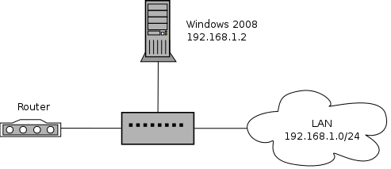
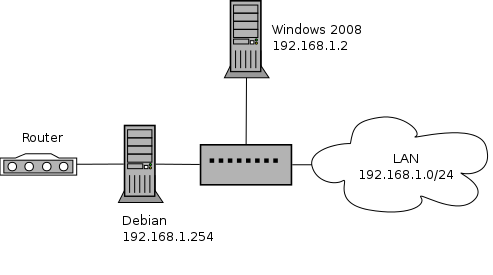

# Proyecto 1: Instalación de un servidor en un centro educativo
Nos han contratado para instalar y configurar un servidor que de servicio a un centro educativo. En la actualidad poseen un servidor ofreciendo algunos servicios, pero es necesario hacer una migración para poder ofrecer más servicios.

##1. Esquema de red actual

Como podemos ver en el esquema de red, en la actualidad dentro de nuetra red local tenemos instalado un servidor implantando con Windows Server 2008 que ofrece los siguientes servicios.

### a) Servidor DHCP

Los ordenadores clientes de nuestra LAN obtienen su configuración de red ofrecidas por dicho servidor, que tiene las siguientes características:

* Rango: 192.168.1.3-192.168.1.254
* Máscara de red: 255.255.255.0 
* Puerta de enlace: La ip del router
* DNS: Según el que te convenga para hacer las pruebas 

### b) Servidor DNS

Lo primero que tienes que hacer es determinar el nombre de dominio (puede ser el nombre del insitituo, inventatelo) que va a ser utilizado en nuestro sistema. (En esta documentación voy a utilizar el nombre example.com). El servidor DNS ofrece el servicio de resolución de nombres para los ordenadores de nuestra red local. Debes tener en cunta los siguientes puntos:

* Cuando tengas funcionando el servidor DNS, tendrás que modificar el servidor DHCP para que los clientes usen el servidor DNS. 
* Piensa el nombre que tiene el servidor. El servidor DNS debe poder resolver los siguientes nombres: nombredelservidor.example.com, www.example.com, informatica.example.com El primero es el nombre del servidor, los dos siguientes son dos páginas webs que el servidor va a servir. 
* Debes implementar la zona inversa del servidor.

### c) Servidor WEB

El servidor tiene instalado un servidor Web IIS, que sirve dos virtual host con páginas web estáticas.

* www.example.com: Página principal del centro.
* informatica.example.com: Página del departamento de informatica
* La página www.example.com, posee un directorio /privado, que para acceder a el es necesario autentificarse.

Deficiencias que nos encontramos con este esquema

1. El servidor es un ordenador más de nuestra LAN, por lo que el cortafuegos que podemos configurar se debería implantar en el router.
2. Igualmente el dispositivo que hace NAT es el router, que puede ser insuficientes para muchos ordenadores. 
3. No se controla de ninguna manera la navegación de los clientes. 
4. El servidor web actualmente instalado solo ofrece página html estáticas. 
5. Algunos servicios que faltan: web dinámica, servicio de ftp, servicio de correos, proxy,...

## 2. Especificación del nuevo esquema de red

El centro educativo ha comprado un servidor, en el que se va instalar una distribución Debian Wheezy, y que se va a instalar siguiendo este esquema de red:

Aunque vamos a mantener el servidor Windows 2008 dentro de nuestra red local, vamos a sustituyendo los distintos servicios que ofrece. Se mantiene por que suponemos que ofrece un servicio de directorio activo que no vamos a sustituir.

### a) Enrutador

Como se observa en el esquema nuestro ordenador va a tener dos tarjetas de red, por lo tanto va a ser el responsable de gestionar la comunicación que entra y sale de nuestra red local. En una segunda fase de nuestra implantación (esto se estudiará en la asignatura de seguridad) se implantará un cortafuego en este equipo. Lo que tenemos que configurar este equipo para que enrute y haga la función de NAT.

### b) Servidor DHCP

Debes instalar un servidor DHCP en este ordenador. Para probarlo sin ningún problema debes parar el servidor DHCP del Windows 2008. Debe tener las siguientes características:

* Rango: 192.168.1.3-192.168.1.253
* Máscara de red: 255.255.255.0 
* DNS: Según el que te convenga para hacer las pruebas 

### c) Servidor Web

En nuestro servidor debian vamos a instalar un servidor Web apache2 que haga las funciones del antiguo servidor web del windows 2008. Tendrá las siguientes características.

1. Nuestro servidor va  a seguir teniendos dos hosts virtuales: www.example.com y informatica.example.com
2. La página www.example.com va a ser la página principal del instituto, por lo que vamos a instlar un CMS wordpress, para ello configura un servidor LAMP.
3. Instala el programa phpmyadmin para gestionar las bases de datos. A este aplicación web sólo se puede acceder desde la intranet.
4. Por seguridad, en la página www.example.com, no se permite que se sigan enlaces simbólicos, no se permite negociación de contenidos, no se permite visualizar la lista de ficheros y no se permite usar ficheros .htaccess.
5. La página informatica.example.com es la página principal del departamento de informática y en ella vamos a instalar una plataforma moodle. Dicha aplicación web estará instalada en un directorio llamado plataforma. Por lo tanto si accedemos a informatica.example.com se debererá redirigir automáticamente a informatica.example.com/plataforma
6. Cada profesor del departamento de informática puede tener una página personal, para ello usa el módulo public_html. En esta página personal se debe poder ejecutar php y poder ser configurada usando ficheros .htaccess.
7. Para llevar una estadistica de visitas y accesos instala la aplicación webalizer en el servidor.
8. En el directorio /srv/isos tenemos una colección de imágenes isos, queremos acceder a ella en la dirección informatica.example.com/isos. Esta dirección debe ser sólo accesible desde la intranet, si accedemos desde fuera tenemos que autentificarnos (digest) con un usuario.
9. Configura la página wordpress para usar URL amigables, módulo rewrite. Modifica del punto 4 lo que sea necesario para que funcione este punto.

### d) Servidor DNS

Vamos a instalar en nuestra red un servidor DNS bind9 que permita la resolución de nombres. Este servicio va a sustituir al servidor Windows 2008. El servidor DNS ofrece el servicio de resolución de nombres para los ordenadores de nuestra red local. Debes tener en cunta los siguientes puntos:

* Cuando tengas funcionando el servidor DNS, tendrás que modificar el servidor DHCP para que los clientes usen el servidor DNS. 
* Piensa el nombre que tiene el servidor. El servidor DNS debe poder resolver los siguientes nombres: nombredelservidor.example.com, www.example.com, informatica.example.com. El primero es el nombre del servidor, los dos siguientes son dos páginas webs que el servidor va a servir. 
* Debes implementar la zona inversa del servidor.

Además nos indican que los profesores de informáticas les gustaría poder dar de alta nuevos nombres en el servidor DNS. Para ello vas a crear un scipt en python que nos permita añadir o borrar registros en las zonas de nuestro servidor.

El script se debe llamar gestionDNS.py y recibe cutro parámetros:

* -a o -b: Si recibe -a añadirá un nuevo nombre, si recibe -b borrará el nombre que ha recibido.
* -dir o -alias, si recibe -dir va a crear un registro tipo A, si recibe -alias va a crear un registro CNAME
* El nombre de la máquina para añadir o borrar
* El nombre del alias o la dirección ip: Si has usuado la opción -dir recibirá una ip y si has usuado -alais recibirá el nombre de la máquina a la que le vamos a hacer el alias. Si has utilizado -b no teendrá este parámetro.

Ejemplos

    gestionDNS.py -a -dir smtp 192.168.4.1

	Creará el registro -> smtp    A    192.168.4.1

    gestionDNS.py -a -alias correo smtp

	Creará el registro -> correo      CNAME    smtp

    gestionDNS.py -b correo

	Borrará el último registro

Todos los registros creados o borrados pertenecen a las zonas example.com. Se debe modificar la zona inversa en los casos necesarios. El script debe reinciar el servidor bind9.

**[OPCIONAL]**: Por último nos piden que sea posible que el servidor DNS resuelva el nombre de los clientes que reciben ip por medio del servidor DHCP, por lo que deberas contemplar la configuración de un dns dinámico.

[Volver](index)
